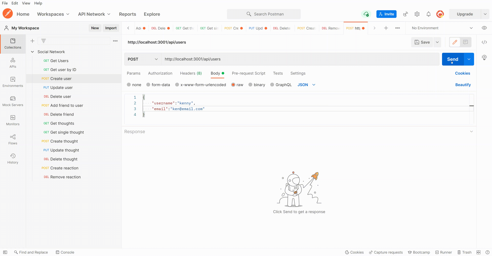

# Social Network API

## Description

An API for a social network web application created using Node, Express, Mongoose, and MongoDB. Users can share their thoughts, react to friends’ thoughts, and create a friend list.

---

## Table of Contents

1. [Installation](#installation)
2. [Usage](#usage)
3. [Build](#build)
4. [License](#license)
5. [Contributing](#contributing)
6. [Questions](#questions)

## Installation

You can run this application locally by:

1. Clone this repository `git clone git@github.com:oli-drew/social-network-api-bootcamp-hw18.git`
2. Navigate to inside the repository `cd social-network-api-bootcamp-hw18/`
3. Install the required packages using `npm install`
4. Make sure your MongoDB database server is running.
5. Start the application server by running `npm start`
6. By default, the server will be listening on port 3001.

## Usage

Once installation steps above have been completed, open an api testing application such as Postman or Insomnia.

### Creating data

### Reading data

### Updating data

### Deleting data

### Walkthrough Video

A video walkthrough of how to use this application is available here: [Video](https://drive.google.com/file/d/18GcgNkAMK_CMe8heKCILexc3MLXiucvU/view?usp=sharing)

### Screenshot

## Build

The following technology stack was used:

- Node.JS
- Express.JS
- Mongoose ODM
- MongoDB
- DayJS

## License

This project is licensed under MIT.

## Contributing

- Oliver Drew

## Questions

If you have any questions please contact me via [GitHub](https://github.com/oli-drew) or [Email](mailto:oli-webdev@protonmail.com)
